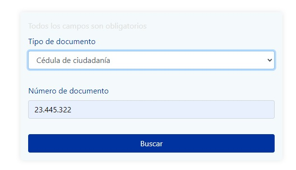
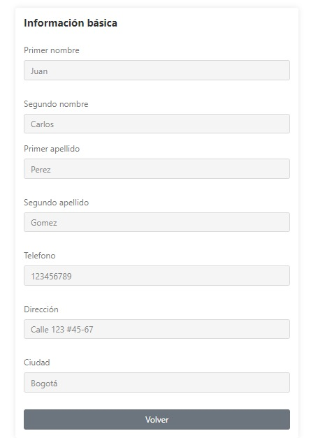

---

# Sistema de Gestión de Clientes


## Descripción

Este es un proyecto de sistema de gestión de clientes desarrollado en Angular. Permite a los usuarios buscar clientes por tipo y número de documento, y muestra un resumen de la información del cliente encontrado.

## Funcionalidades

- Búsqueda de clientes por tipo y número de documento.
- Visualización de la información del cliente encontrado.
- Navegación entre la pantalla de entrada y el resumen del cliente.

## Tecnologías Utilizadas

- Angular 18
- Jasmine 5
- Karma 6
- Typescript 5

## Instalación y Ejecución

### Prerrequisitos

- Angular 18

### Paso a Paso

1. **Clonar el repositorio:**

   ```bash
   git clone https://github.com/cysorianop/customer-info-app.git
   cd customer-info-app
   ```

2. **IKnstala dependencias:**

   ```bash
   npm install
   ```

3. **Ejecutar la aplicación:**

   ```bash
   ng serve
   ```

La aplicación estará disponible en `http://localhost:4200/`.

## Uso

- Ingresa el tipo y número de documento del cliente que deseas buscar en la pantalla de entrada.
- Haz clic en el botón "Buscar" para buscar el cliente.
- Se mostrará un resumen del cliente si se encuentra.

## Capturas de Pantalla

### Pantalla de Entrada


*Pantalla de entrada: Los usuarios pueden ingresar el tipo y número de documento para buscar un cliente.*

### Resumen del Cliente


*Resumen del cliente: Muestra la información del cliente encontrado.*

### Pruebas Unitarias

Para ejecutar las pruebas unitarias:

```bash
ng test
```

## Contribuir

Si deseas contribuir a este proyecto, por favor sigue los siguientes pasos:

1. Haz un fork del repositorio.
2. Crea una nueva rama (`git checkout -b feature/nueva-funcionalidad`).
3. Realiza los cambios necesarios y realiza commits (`git commit -m 'Añadir nueva funcionalidad'`).
4. Sube los cambios a tu repositorio (`git push origin feature/nueva-funcionalidad`).
5. Abre un Pull Request.

## Licencia

Este proyecto está licenciado bajo la Licencia MIT. Consulta el archivo `LICENSE` para más detalles.

---
